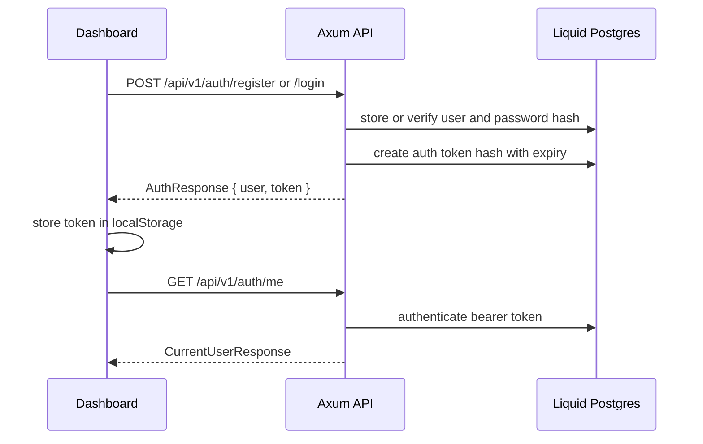
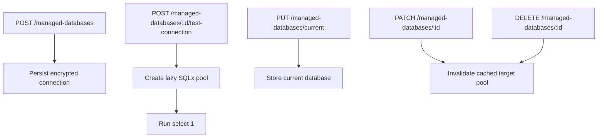
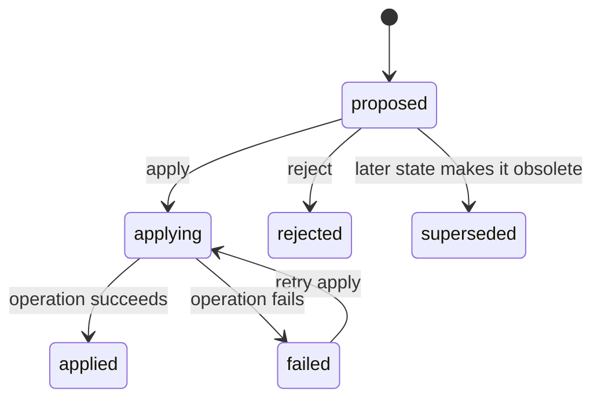
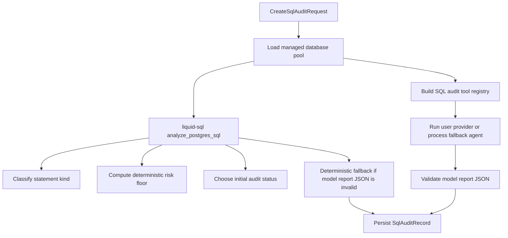

# Core Flows

This page describes the end-to-end behavior that crosses crates and frontend
components.

## Authentication Flow

Passwords are hashed in storage code. Logout revokes the token by setting
revocation state in the application database. All authenticated API routes read
the `Authorization: Bearer <token>` header.

## Managed Database Flow

Managed databases are user-owned PostgreSQL connection records. The stored
record contains connection metadata and an encrypted password. Public DTOs expose
`has_password`, not the password value.

The pool manager is keyed by `owner_user_id` and `database_id`. It uses bounded
connection counts, acquire timeout, idle TTL, and a background reaper.

## Chat Turn Flow

1. The frontend creates a conversation or selects an existing one.
2. The user sends a chat message with optional dashboard context.
3. `POST /api/v1/chat/conversations/{conversation_id}/turns` creates:
   - a user message,
   - an `agent_turn` in `queued` status,
   - a background task to run the turn.
4. The frontend opens `/api/v1/chat/turns/{turn_id}/stream`.
5. The turn runner marks the turn `running`, appends events, loads context, and
   checks user-level LLM provider settings.
6. If no provider is configured, the turn becomes `blocked`.
7. Otherwise the workbench agent streams assistant deltas and may call read-only
   PostgreSQL tools.
8. The API persists tool calls, tool results, assistant content, and proposed
   actions.
9. If actions were proposed, the turn becomes `waiting_for_user`; otherwise it
   becomes `completed`.

The stream route polls ordered `agent_turn_events` by sequence number and emits
typed `ChatStreamEvent` values. It sends `ping` frames while the turn is active.

## Action Apply Flow

Agent suggestions are not directly applied. The user applies or rejects each
action:

Applying an action records status changes and streams action updates back to the
client. SQL action application uses the same SQL audit helpers as direct SQL
audit routes, so action execution follows the same deterministic safety gates.

## SQL Audit Creation Flow

Initial status rules:

- Any critical deterministic finding becomes `blocked`.
- A single SELECT becomes `audited`.
- Transaction and control statements become `blocked`.
- A non-SELECT statement with non-empty `execution_purpose` becomes
  `pending_approval`.
- A non-SELECT statement without execution purpose becomes `audited`.
- Multiple statements or unclassified statements become `blocked`.

The persisted risk score is the max of deterministic risk floor and model report
risk score.

## SQL Audit Approval and Execution Flow

Approval and rejection mutate the audit lifecycle:

- `POST /api/v1/sql-audits/{id}/approve` stores approver, timestamp, and comment.
- `POST /api/v1/sql-audits/{id}/reject` stores rejecter, timestamp, and comment.

Execution first verifies that the managed database connection snapshot on the
audit still matches the current managed database record.

SELECT execution:

1. Allowed for `audited`, `approved`, or already `executed` records.
2. Materializes a read-only datapanel query with a 100-row limit.
3. Returns the audit record plus an internal query result outcome for chat action
   use.

Write execution:

1. Requires `LIQUID_SQL_EXECUTION=write_gated`.
2. Marks the audit `executing`.
3. Runs the approved SQL with write-gated PostgreSQL tooling.
4. Completes with statement kind, affected rows, elapsed time, risk floor, and
   execution findings, or records an execution error.
5. Deterministic rejection errors are returned as conflicts.

## SQL Mode Flow

SQL mode is created with
`POST /api/v1/chat/conversations/{conversation_id}/sql-executions`.

The API:

1. Requires the conversation to have a selected managed database.
2. Creates a turn and user message containing the SQL.
3. Validates exactly one PostgreSQL statement.
4. Rejects transaction and control statements.
5. Executes SELECT through the read-only datapanel materialization path.
6. Executes mutation statements with a 5 second statement timeout and lock
   timeout.
7. Commits successful mutation statements.
8. Appends an assistant message containing either query results, a summary, or an
   error.

## Datapanel Flow

Every conversation has one datapanel, created lazily by
`GET /api/v1/chat/conversations/{conversation_id}/datapanel`.

Cards can be created from:

- direct SQL mode query results,
- applied `create_datapanel_card` agent actions.

Card refresh runs the stored SELECT again and replaces `result`. Layout saves
debounce on the frontend and call `PATCH /api/v1/datapanels/{panel_id}/layout`.
Preview creation stores or returns a unique slug and exposes sanitized panel data
through `/api/v1/datapanel-previews/{slug}` without authentication.

## Database Backup and Restore Foundation

Backup and restore have storage, tool, and worker foundations, but they are not
exposed as first-class REST routes and the current workbench apply endpoint
rejects `start_database_backup` and `start_database_restore` action kinds.

The implemented backend foundation works as follows:

1. Database operation tool implementations can create queued `database_backups`
   or `database_restore_jobs` rows through `DatabaseBackupMetadataStore`.
2. When `LIQUID_BACKUP_S3_BUCKET` is set, API startup creates an
   `S3BackupObjectStore` and spawns `DatabaseOperationWorker` tasks.
3. The worker marks stale jobs failed, then repeatedly claims the next queued
   backup or restore.
4. A backup job:
   - loads the managed database connection,
   - runs `pg_dump --format=custom --no-owner --no-acl`,
   - computes SHA-256,
   - uploads to S3-compatible storage,
   - records bucket, key, size, checksum, and tool version metadata.
5. A restore job:
   - downloads the backup object,
   - loads the target managed database connection,
   - runs `pg_restore --clean --if-exists --single-transaction --no-owner
     --no-acl --exit-on-error`,
   - marks the restore succeeded or failed.

The worker redacts managed database passwords from process error strings before
persisting failures.
