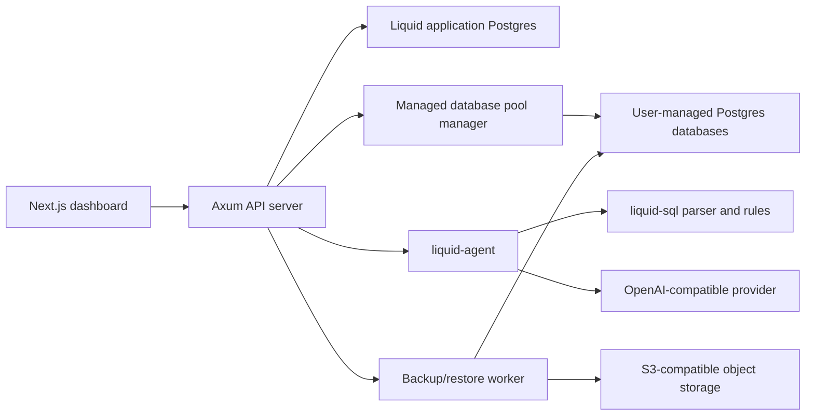

# System Architecture

Liquid is a Rust backend plus a separately served Next.js frontend. The backend
is a single API process that owns HTTP routes, Liquid application storage,
managed PostgreSQL connection pools, AI agent execution, and optional database
backup workers.

## Runtime Components

| Component | Runtime Role |
| --- | --- |
| `liquid` CLI | Loads config, connects storage, runs migrations, chooses the startup audit agent, and starts the API server. |
| Axum API | Serves JSON and SSE routes under `/api/v1` plus `/healthz`. |
| Liquid application database | Stores users, tokens, managed database metadata, SQL audits, chat state, actions, datapanels, settings, and backup job metadata. |
| Managed database pool manager | Creates lazy SQLx pools for user-managed target databases and reaps idle pools. |
| SQL audit agent | Uses deterministic SQL analysis and optional LLM tool calls to produce audit reports. |
| Workbench agent | Streams assistant text, PostgreSQL tool progress, and proposed actions for chat turns. |
| Backup worker | Claims queued backup or restore jobs and runs `pg_dump` or `pg_restore` when S3 backup storage is configured. This is backend foundation work; backup jobs are not exposed through REST routes yet. |
| Next.js dashboard | Renders authentication, database selection, chat, SQL mode, datapanel cards, settings, and API stream events. |

## Crate Boundaries

The Rust workspace keeps ownership boundaries explicit:

| Crate | Owns | Should Not Own |
| --- | --- | --- |
| `liquid-cli` | Process startup, command parsing, config file creation, startup summary, agent selection. | Route handlers, storage queries, SQL rule logic. |
| `liquid-api` | Axum routing, API state composition, request authentication, response mapping, SSE streams. | Database schema details, LLM wire protocol mapping. |
| `liquid-config` | Defaults, TOML parsing, environment overrides, mode parsing and validation. | Process startup side effects. |
| `liquid-core` | Serializable domain and transport types, shared traits for managed database loading and backup metadata. | SQLx rows, Axum extractors, provider clients. |
| `liquid-agent` | Agent prompts, tool loops, tool registry, PostgreSQL tools, database operation worker. | HTTP route registration or frontend concerns. |
| `liquid-llm` | LLM request/response abstraction, OpenAI-compatible Chat Completions and Responses mapping, streaming event parsing. | SQL audit policy. |
| `liquid-sql` | PostgreSQL parser integration, statement classification, deterministic rules, metadata result types. | Persistent audit lifecycle decisions. |
| `liquid-storage` | SQLx migrations and queries, password/API-key encryption, auth token hashing, managed pool implementation. | API route shape or UI rendering. |

`liquid-core` is the contract center. It exports DTOs with `ts-rs`, and the
frontend imports the generated TypeScript files from
`liquid-ui/lib/generated/api-types`.

## API State

`ApiState` contains:

- `agent`: a process-level `SqlAuditAgent` used for audit summary and fallback
  audits,
- `store`: a `LiquidStore` trait object,
- `managed_database_pools`: lazy target database pools keyed by owner and
  database id,
- `sql_metadata_required`: whether metadata tool failures should fail audits,
- `sql_execution`: the configured PostgreSQL tool execution mode,
- `approved_write_execution_enabled`: derived from `write_gated`,
- injectable executors for approved SQL, chat SQL, and connection tests.

Tests use the injected executor traits to verify route behavior without running
real target database mutations.

## Startup Sequence

The `liquid server` command performs this sequence:

1. Resolve `--config` or create `~/.liquid/config.toml` from defaults.
2. Apply environment overrides.
3. Print a startup summary with redacted database and provider credentials.
4. Connect to the Liquid application database.
5. Run migrations when `database.auto_migrate` is enabled.
6. Build the process-level audit agent:
   - mock agent when `OPENAI_API_KEY` or `OPENAI_MODEL` is missing,
   - OpenAI-compatible tool-calling agent otherwise.
7. Bind the Axum listener.
8. Build the managed database pool manager and spawn its idle reaper.
9. Mark stale agent turns failed.
10. Spawn the backup/restore worker when `LIQUID_BACKUP_S3_BUCKET` is set.
11. Serve the router with CORS.

## Frontend Architecture

The frontend is a single Next.js app with client-side state:

- `LiquidApp` owns auth token bootstrap and chooses auth, database picker, or
  workspace state.
- `ManagedDatabasePicker` owns database registration, update, connection test,
  selection, settings, and logout affordances.
- `AuditDashboard` owns conversations and the resizable split-pane workspace.
- `ChatPanel` owns chat messages, SQL mode execution, action decisions, provider
  readiness, and SSE stream consumption.
- `DatapanelWorkspacePanel` owns datapanel metadata, card refresh, layout saves,
  export, preview links, and grid rendering.

All API requests go through `liquid-ui/lib/api.ts`. That wrapper attaches bearer
tokens, parses JSON errors, handles 204 responses, and parses SSE frames for
chat streaming.

## LLM Architecture

`liquid-llm` exposes a small provider-neutral interface:

- `LlmClient::complete` for one-shot responses,
- `LlmClient::stream` for server-sent provider streams,
- `LlmRequest` with messages, tools, temperature, and token limit,
- `LlmResponse` with text, tool calls, raw output, and protocol-specific output
  items.

The OpenAI-compatible client supports:

- `/v1/chat/completions` for Chat Completions,
- `/v1/responses` for Responses,
- complete endpoint URLs or base URLs ending in `/v1`,
- function tools for both protocols,
- text deltas, tool-call deltas, completed tool calls, raw JSON, and done events.

The API can use process-level LLM config for SQL audits, but chat workbench turns
resolve per-user provider settings from `user_llm_provider_settings`.

## SQL Tool Architecture

Liquid has three PostgreSQL tool sets:

| Tool Set | Used By | Tools |
| --- | --- | --- |
| SQL risk tools | Audits without a managed database pool | `inspect_sql_risk` |
| SQL audit tools | Managed database audit route and SQL audit lifecycle | risk inspection, schema listing, relation listing, relation description, EXPLAIN, read-only execution, optional write execution. |
| Workbench tools | Chat mode | schema listing, relation listing, relation description, EXPLAIN, read-only execution. |

Workbench tools intentionally exclude write execution. Write execution is
handled by explicit SQL audit approval and execution routes or by applying
agent-proposed actions.

## Storage Architecture

`liquid-storage` owns concrete SQLx access. It implements:

- `LiquidStore` for the API,
- `ManagedDatabaseConnectionLoader` for target database pools and backup jobs,
- `DatabaseBackupMetadataStore` for the backup worker and operation tools.

The backup metadata and worker interfaces are present before the user-facing
backup product is fully wired into REST routes or supported workbench actions.

Sensitive values are never returned directly in public DTOs:

- bearer tokens are hashed before storage,
- managed database passwords are encrypted,
- user-level LLM API keys are encrypted,
- `Debug` output for managed database connection specs redacts passwords.

## Deployment Shape

The Dockerfile builds only the Rust API binary. The runtime image:

- starts `liquid server`,
- binds `0.0.0.0:3001`,
- runs as a non-root `liquid` user,
- does not serve the Next.js dashboard.

Deploy the dashboard separately or run it with `bun run dev` during local
development.
